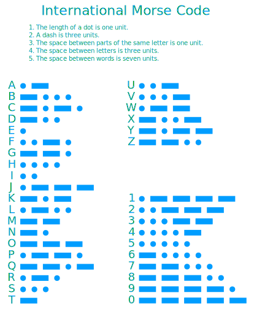

# micro:morse

> A script that allows you to send morse code between two micro:bits.

This is in no way practical, but it's cool to see that it's at least possible.

> Open this page at [https://esotericenderman.github.io/micro-morse/](https://esotericenderman.github.io/micro-morse/)

## Usage

See the morse code chart below for help:

In the above diagram:
- The dots &centerdot; represent short signals.
- The dashes - represent long signals.

1. Button **A** is a short signal.
2. Button **B** is a long signal.
3. Begin by typing out a letter using the **A** and **B** buttons.
4. When you are done, type the termination sequence **AAAAAB**. This will add the letter to what will be sent.
5. To send the current string, type the *end* character by typing **ABAB**. This will send the string to all other micro:bits on the radio frequency.

## Use as Extension

This repository can be added as an **extension** in MakeCode.

* open [https://makecode.microbit.org/](https://makecode.microbit.org/)
* click on **New Project**
* click on **Extensions** under the gearwheel menu
* search for **https://github.com/esotericenderman/micro-morse** and import

## Metadata (Used for Search, Rendering)

* for PXT/micro:bit

## Changelog

### 1.0.0

- Created the basic functionality of this project.

**Full Changelog**: https://github.com/esotericenderman/micro-morse/commits/1.0.0

### 1.0.1

- Removed a weird file from the [first release](#1.0.0).

**Full Changelog**: https://github.com/esotericenderman/micro-morse/compare/1.0.0...1.0.1

## Credit

### [International Morse Code](https://commons.wikimedia.org/wiki/File:International_Morse_Code.svg?)

By Rhey T. Snodgrass and Victor F. Camp\
[In the public domain](https://commons.wikimedia.org/wiki/File:International_Morse_Code.svg?#Summary)

## License

&copy; 2024-2025 [Esoteric Enderman](https://enderman.dev)

[micro:morse](/) is licensed under the [AGPL 3.0](./LICENSE) only.

## Topics

[radio](https://github.com/topics/radio), [typescript](https://github.com/topics/typescript), [morse-code](https://github.com/topics/morse-code), [ts](https://github.com/topics/ts), [microbit](https://github.com/topics/microbit), [morse-codes](https://github.com/topics/morse-codes), [morsecode](https://github.com/topics/morsecode), [makecode](https://github.com/topics/makecode), [microbit-scripts](https://github.com/topics/microbit-scripts), [microsoft-makecode](https://github.com/topics/microsoft-makecode), [microbit-radio](https://github.com/topics/microbit-radio), [morse-translator](https://github.com/topics/morse-translator), [micro-bit](https://github.com/topics/micro-bit), [morse-code-translator](https://github.com/topics/morse-code-translator), [makecode-arcade](https://github.com/topics/makecode-arcade), [morse-code-converter](https://github.com/topics/morse-code-converter), [microbits](https://github.com/topics/microbits)
